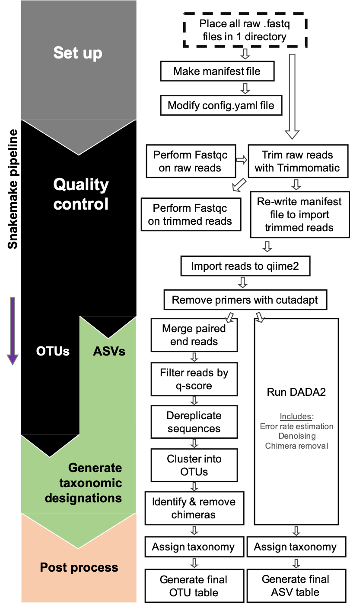

# Pipeline to run qiime2 with snakemake
_January 2020_
_Sarah Hu_

Run [QIIME2](https://www.nature.com/articles/s41587-019-0209-9) using [snakemake](https://academic.oup.com/bioinformatics/article/28/19/2520/290322). Requires input of raw .fastq reads. Below describes steps to set up environment and run a test dataset.
This Snakemake pipeline can be easily scaled up to larger datasets and includes scripts to submit Snakemake jobs to slurm.    
Make tag-sequencing analyses higher throughput, more robust, and reproducible.

## Overview
### _Pipeline_
Set up  
1. Generate manifest.txt file from a directory containing all raw .fastq files (R)
2. Read in raw .fastq files and perform *fastqc*, *Trimmomatic*, and repeat *fastqc* on newly trimmed reads (snakemake)
3. Modify manifest.txt file so input files are the trimmed .fastq reads
4. Import all trimmed reads as QIIME2 artifact
5. Remove primers with cutadapt

_Amplicon Sequence Variants_  

6. Run DADA2, which performs additional quality trimming, filtering, and denoising steps. Also removes chimeric sequences. Finally, determines *Amplicon Sequence Variants*
7. Assigns taxonomy using QIIME2 feature classifer
8. Generates ASV count and taxonomy tables
9. Compiles ASV count + taxonomy table (R)

_Operational Taxonomic Units_   

10. Merged paired end reads and filter reads by qscore
11. Dereplicate sequences
12. Cluster into OTUs (open reference & closed reference currently written)
13. Determine chimeras using uchime with the reference database
14. Remove chimeras from representative sequences and cluster table
15. Assign taxonomy using QIIME2 feature classifier
16. Generate OTU count and taxonomy tables
17. Compile OTU count + taxonomy table


### _Summary of workflow_

<p align="center">
  
</p>

***
# Set up: Before starting
* Familiarize yourself with conda environments if you are not already [Explanation using R](https://alexanderlabwhoi.github.io/post/anaconda-r-sarah/) and from [Anaconda](https://docs.conda.io/projects/conda/en/latest/user-guide/tasks/manage-environments.html).
* Be familiar with the qiime2 options to determine Amplicon Sequence Variants or Operational Taxonomic Units

_New to Snakemake?_
If you're new to snakemake, [learn more here](https://snakemake.readthedocs.io/en/stable/) or follow a recommended [tutorial](https://github.com/ctb/2019-snakemake-ucdavis).  
_New to QIIME2?_
[Download qiime2 using a conda environment](https://docs.qiime2.org/2019.10/install/native/) and run through a few tutorials with a small test data set. *Disclaimer* this will automatically download the most recent version of QIIME2. The below snakemake pipeline is currently running v2019.4. I will update in the future, but take note that a few things have changed.    

## 1. Set up working directory, conda environments, and taxonomy database
### 1.1 Create and launch a conda environment to run this pipeline.
All environments to run this pipeline are in ```/tagseq-qiime2-snakemake/envs/```, including an environment to run snakemake.

```
# Download this repo and enter
git clone https://github.com/shu251/tagseq-qiime2-snakemake.git
cd tagseq-qiime2-snakemake

# Create conda environment from exisiting yaml file:
conda env create --name snake-tagseq --file envs/snake.yaml 

# Enter environment
source activate snake-tagseq

# Check versions and correct environment set up
snakemake --version
## Output should be: 5.5.2
```

### 1.2 Place all raw fastq files in one place

Either within the downloaded repo (e.g., raw_dir/) or elsewhere you have access to, make sure all .fastq.gz you plan to process are in one place.

#### **Run with test data**
Migrate to raw_dir and download one of the test datasets:
```
cd raw_dir #migrate to raw_dir directory
bash 18S-download-testdata.sh
```
To make the manifest file that is required for qiime2, enable an R environment and run the provided R script: ```scripts/write-manifest-current.R```
```
# Enable an R working environment
conda activate r_3.5.1

# Make sure you are in the directory with all the raw sequence files.
Rscript $PATH/tagseq-qiime2-snakemake/scripts/write-manifest-current.R

# Output file:manifest-orig.txt
```

#### **If using your own fastq files**  
1. Place them in their own ```raw_data``` directory (see step to update config.yaml to tell snakemake where these are located).   
2. Create a manifest file for these sequences. You can also follow the instructions above to use the provided R script to automatically generate one. ```scripts/write-manifest-current.R``` detects all fastq.gz files in the curren directory and creates a manifest file ready for qiime2 import.

*Make your own manifest file without the R script*: 
Format your own txt file (using a text editor or a CSV file) exactly this way. Every line must be comma separated, with sample-id, followed by the path of fastq file, followed by either "forward" or "reverse". 
```
sample-id,absolute-filepath,direction
sample1,$PWD/raw_seqs_dir/Test01_full_L001_R1.fastq.gz,forward
sample1,$PWD/raw_seqs_dir/Test01_full_L001_R2.fastq.gz,reverse
sample2,$PWD/raw_seqs_dir/Test02_full_L001_R1.fastq.gz,forward
sample2,$PWD/raw_seqs_dir/Test02_full_L001_R2.fastq.gz,reverse
```
Guidelines:   
* Replace $PWD with your path
* The fastq files can be gziped. 
* List all of your fastq files. 
* Save the file and name it "manifest.txt".

**Disclaimer**: the above manifest file format has changed in later versions of qiime2. (_Jan 1. 2020))_

### 1.3 Prep taxonomy database

Qiime2 requires that all sequence files are imported as artifact files. This is no different for reference databases. Do this [manually using the qiime2 website instructions](https://docs.qiime2.org/2019.10/tutorials/feature-classifier/). You can also automate this using [a snakemake pipeline here](https://github.com/shu251/db-build-microeuks) - while this shows how to download the PR2 18S reference database, this can be swapped for other. A quick explanation of how to do this manually:

```
conda activate qiime2-2019.4 # If using verion with this tutorial
# First import the database
qiime tools import \
  --type 'FeatureData[Sequence]' \
  --input-path $PWD/db/pr2.fasta \
  --output-path $PWD/db/pr2.qza

# Then the taxonomy file
qiime tools import \
  --type 'FeatureData[Taxonomy]' \
  --input-format HeaderlessTSVTaxonomyFormat \
  --input-path $PWD/db/pr2_tax.txt \
  --output-path $PWD/db/pr2_tax.qza

# Select V4 region from the PR2 database
# Use appropriate forward and reverse primers
qiime feature-classifier extract-reads \
  --i-sequences $PWD/db/pr2.qza \
  --p-f-primer CCAGCASCYGCGGTAATTCC \
  --p-r-primer ACTTTCGTTCTTGATYRA \
  --p-trunc-len 150 \
  --o-reads $PWD/db/v4_extracts.qza

# Train the classifier
qiime feature-classifier fit-classifier-naive-bayes \
  --i-reference-reads $PWD/db/v4_extracts.qza \
  --i-reference-taxonomy $PWD/db/pr2_tax.qza \
  --o-classifier $PWD/db/pr2_classifier.qza
```

*Note where this qiime2 artifact (.qza file) is stored to reference below.

## 2. Modify config.yaml to run snakemake with your data
Now, take a look at ```config.yaml```. Below is a breakdown of the parameters you need to revise in your config file. Edit this file to fit your computer set-up.   
Checklist of all the things you need to know ahead of time:
- [ ] Full path location to the directory with all of your raw fastq files
- [ ] Output location - where snakemake should write all output files to
- [ ] Full path location to and name of the manifest file you generated based on the above instructions
- [ ] Full path location to the QIIME2-formatted reference sequences and taxonomy names (from above)
- [ ] What is your fastq file _suffix_? Examples of *file name/suffix*: sample01_S30_R1_001.fastq.gz/_001.fastq.gz, sample304_S31_1.fastq.gz/.fastq.gz
- [ ] What is the designation of read 1 (forward) and read 2 (reverse)? Examples of *file name/read pair designation*: sample01_S30_R1_001.fastq.gz/R1, sampleXX_jan2015_2.fastq/2
- [ ] Primer sequence of the target amplicon
_Operational Taxonomic Units_
- [ ] What is the target final length of your amplicon? (e.g., 18S rRNA gene V4 hypervariable region is ~400bp). Related, think about how much error you can live with when you merge the sequences (overlap and error)
- [ ] What is your desired quality score (q-score, Phred score) cut off? If you're not sure, and think you need to deviate from the default, see below suggestion and option for this.
- [ ] For _de novo_ OTUs, what is your percent ID? Currently at 3%, or 97% seq similarity (0.97)
_Amplicon Sequence Variants
- [ ] To determine Amplicon Sequence Variants, know what quality error parameters you want to enabled during the DADA2 step.

This config.yaml file is set up to run with the test sequences downloaded from above:

* ```proj_name: Diel_18S``` Replace this with your project name. This will be what the final ASV qiime2 artifact and ASV table is named.  
* ```raw_data: /vortexfs1/omics/huber/shu/tagseq-qiime2-snakemake/raw_data``` Point config file to location of your raw fastq reads, in this case a directory called 'raw_data'   
* ```scratch:  /vortexfs1/scratch/sarahhu``` Change this to where you want all your outputs to be written. Since I am working on a HPC, I write all of this to scratch and move it later.
* ```outputDIR: /vortexfs1/omics/huber/shu/tagseq-qiime2-snakemake/``` Output directory for qiime2 visualization files to be written to. This is for QCing sequences.
* ```manifest: manifest.txt``` Input of manifest file that you need to provide, generated using R script or created by you.   
* ```manifest-trimmed: manifest-trimmed.txt``` Final manifest file, the Snakemake pipeline will create this file, as the first few steps generate the trimmed fastq files which we ACTUALLY want to use in the QIIME2 part, so the Snakemake file is written to input your manifest file and modify the filepath   
Designations for file names:
* ```suffix:``` and ```r1_suf/r2_suf``` comment out ```#``` the lines not applicable to your sample names.
Modify lines specific for OTU or ASV determination:
* ```primerF: CCAGCASCYGCGGTAATTCC``` Forward primer sequence, in this case I'm using the V4 hypervariable region  
* ```primerR: ACTTTCGTTCTTGATYRA``` Reverse primer sequence   
Reference database:
#### Database
* ```database: /vortexfs1/omics/huber/shu/db/pr2-db/V4-pr2_4.12.0.qza``` Reference sequence database imported as a QIIME2 artifact
* ```database_classified: /vortexfs1/omics/huber/shu/db/pr2-db/V4-pr2_4.12.0-classifier.qza``` Classified reference database, processed be subsetting with your primer sequence and running the qiime2 classifier
* ```database_tax: /vortexfs1/omics/huber/shu/db/pr2-db/pr2_4.12.0_tax.qza``` Replace with the taxonomy names associated with the above database


#### DADA2 parameters 
For the DADA2 step to determine ASVs, you also need to specify the forward and reverse read truncation
```
truncation_err: 2
truncation_len-f: 200
truncation_len-r: 200

#Truncate sequences at the 3' end when sequence quality may decrease
--p-trunc-len-f #forward read truncation
--p-trunc-len-r #reverse read truncation

#Trim forward and reverse reads at 5' end based on quality
--p-trim-left-f #forward read trim
--p-trim-left-r #reverse read trim

quality_err: 2
training: 1000 #should be set higher for a non-test dataset
chimera: pooled
#Quality threshold for above trimming
--p-trunc-q

#Any reads with expected error higher than this value will be removed
--p-max-ee

#Choice of chimera removal - Choices('pooled', 'none', 'consensus')
--p-chimera-method

#Number of reads to consider in training set for error model
--p-n-reads-learn # defaul is 1 million
```

#### OTU parameters
For clustering OTUs and the steps preceeding OTU clustering, set parameters in the config.yaml file:
```
# Primer removal information
primer_err: 0.4
primer_overlap: 3

# Merge paired end reads
minoverlap: 10
maxdiff: 4
minlength: 270

# Quality filtering of merged reads
minphred: 4
qualwindow: 3 

# Open reference OTU clustering
perc_id: 0.90
otu-thread: 1

# Chimera checking
chimera-thread: 1
```
If you're unsure about parameters, consult the QIIME2 reference manual.


## 3. Run a dry run of snakemake pipeline 

Use *-s* to select between the two snakefiles
```
snakemake -np -s Snakefile-asv
snakemake -np -s Snakefile-otu
# output should be all green and display no errors
``` 

### 3.1 Enable to run on HPC with SLURM

The main reason to use snakemake is that it will work with slurm on your HPC and continue to submit jobs for you. To set this up follow the instructions below.

* [Read about executing snakemake on a cluster](https://snakemake.readthedocs.io/en/stable/executable.html) and another explanation on how to execute with a submit script can be found [here](https://hpc-carpentry.github.io/hpc-python/17-cluster/).    
* Review the submit scripts available in ```submitscripts```. Files in this directory include another config file called ```cluster.yaml```, and two scripts to submit your snakemake pipeline to the cluster with and without the dry run option.   
* Then, open and modify the ```cluster.yaml``` to fit your machine. Then test run using the provided submit scripts.
* Make sure to look at each step in the snakefile and consider what thread, memory, and time requirements you can submit on your HPC. You can specify these in the ```cluster.yaml``` file.    

Once the above are figured out you can run the submit scripts provided in ```submitscripts/```.

```
# Make sure you are still in the snake-tagseq conda environment
## For ASVs:
bash submitscripts/dry-submit-slurm-ASV.sh 

## For OTUs:
bash submitscripts/dry-submit-slurm-OTU.sh
```
Outputs should all be green and will report how many jobs and rules snakemake plans to run. This will allow you to evaluate any error and syntax messages.  


## 4.  Execute full run
### 4.1 Start run
To run the full pipeline make sure you enable the ```--use-conda``` flag. This is because snakemake uses the conda environments stored$
```
# For ASVs
snakemake --use-conda -s Snakefile-asv

# For OTUs
snakemake --use-conda -s Snakefile-otu
```
Run with screen, tmux, or nohup.

### 4.2 Run with HPC
Once the dry run is successful with the dry run script, use the submit-slurm.sh script to submit the jobs to slurm. Run with screen, tmux, or nohup.
```
# Full run for ASVs:
bash submitscripts/submit-slurm-ASV.sh

# Full run for OTUs:
bash submitscripts/submit-slurm-OTU.sh
```
Run the above in *tmux* or *screen*, as it will print out the jobs it submits to SLURM. You will be able to monitor the progress this way.


## 5. Output from pipeline

### 5.1 File structure
To monitor output files migrate to the ```scratch``` directory specified in the config.yaml. 
```
├── fastqc 	#Individual fastqc files for each read
├── logs 	#log files for all pre-qiime2 commands
├── qiime2 	#directory with all qiime2 artifact files
└── trimmed 	#location of all trimmed reads
```
Within the ```qiime2/``` directory, there is a separate directory for each of the OTU or ASV qiime2 artifact files.
```
├── asv #ASV artifact files from qiime2
├── logs #all log files for qiime2 commands
├── otu #qiime2 artifact files for OTU clustering
├── test-18Sv4-PE-demux-noprimer.qza #artifact file post-primer removal
└── test-18Sv4-PE-demux.qza #Initial import artifact file
```

### 5.2 Generate final OTU or ASV table
The provided R script, ```scripts/make-count-table-wtax.R```, will generate a formatted text file that includes the sequence counts per OTU or ASV and the assigned taxonomy. Run this similar to the above manifest R script.

```
# Enable an R environment
conda activate r_3.5.1

# Make sure you are in the qiime2/otu/ or qiime2/asv/ directory and can access the Rscript
# Execute:
Rscript $PATH/tagseq-qiime2-snakemake/scripts/make-count-table-wtax.R
```
Output will be a text file with the date ```CountTable-wtax-YYYY-MM-DD.txt```. The first column of the text file is the feature ID, subsequent columns list sample names. Final columns report taxonomy assignment. A second file will also be created ```CountTable-wtax-bylevel-YYYY-MM-DD.txt```, which will separate the taxonomy names out if separated by a semi colon.    
 

Find an introduction to R for processing ASV or OTU tables [here](https://github.com/shu251/PreliminaryFigures_V4_tagseq).

## 6. How to quality check sequence data

### 6.1 Check overall sequence quality
The snakemake rule, *get_stats*, writes qiime2 visualization files (.qzv) from the artifact files (.qza). These are written to the outputDIR specified in the config.yaml file. Drag and drop these to [this qiime2 visualizer site](https://view.qiime2.org). This will allow you to visualize how many sequences were at each step of the pipeline (or are included in each artifact file).   

Pair this with the initial multiqc outputs to have a per sample summary of how many sequences are removed at each quality control step. This will help you diagnose any problems. The output from multiqc, which can be found in the fastqc output directory: ```PATH/fastqc/trimmed_multiqc_general_stats``` and ```trimmed_multiqc.html```. These provide a .html file and a .txt file to report a summary of all fastqc outputs. 

### 6.2 Run snakemake to get quality control information
Often we need to quality check all the sequence data before deciding the parameters of the OTU or ASV determination. To do this, follow all of the above instructions, but instead of executing the full snakemake run as is, run this command to stop it at the *get_stats* rule. Then you can import each of the .qzv files (see 6.1 above) and view how each QC step modified the sequences.   

Run snakemake:
```
snakemake --use-conda -s Snakefile-otu --until get_stats
# Above command will run the Snakefile for OTU clustering, but will stop at the get_stats step.
## An alternative is to run until 'multiqc' to only perform the trimming and fastqc evaluations
```

Run on HPC:
```
bash submitscripts/submit-slurm-trim-stats.sh
## Again, an alterative is to run 'submit-slurm-trim.sh' to only run through the trimming step.
```
[Or use this to trim fastq sequences](https://github.com/shu251/qc-trim).

***

## References
* Köster, Johannes and Rahmann, Sven. “Snakemake - A scalable bioinformatics workflow engine”. Bioinformatics 2012. https://doi.org/10.1093/bioinformatics/bts480.
* Bolyen E. _et al._ 2019. Reproducible, interactive, scalable and extensible microbiome data science using QIIME 2. Nature Biotechnology 37: 852–857. https://doi.org/10.1038/s41587-019-0209-9
* Wingett SW, Andrews S. FastQ Screen: A tool for multi-genome mapping and quality control. F1000Res. 2018 Aug 24 [revised 2018 Jan 1];7:1338. doi: 10.12688/f1000research.15931.2. eCollection - https://www.bioinformatics.babraham.ac.uk/projects/fastqc/
* Ewels P., _et al._ 2016. MultiQC: summarize analysis results for multiple tools and samples in a single report. https://doi.org/10.1093/bioinformatics/btw354.
* Bolger, A. M., Lohse, M., & Usadel, B. (2014). Trimmomatic: A flexible trimmer for Illumina Sequence Data. Bioinformatics, btu170.
* Martin, M., 2011. Cutadapt Removes Adapter Sequences From High-Throughput Sequencing Reads. https://doi.org/10.14806/ej.17.1.200.
* Callahan BJ, McMurdie PJ, Rosen MJ, Han AW, Johnson AJ, Holmes SP. DADA2: High-resolution sample inference from Illumina amplicon data. Nat Methods. 2016;13(7):581–583. doi:10.1038/nmeth.3869
* R Core Team (2017). R: A language and environment for statistical computing. R Foundation for Statistical Computing, Vienna, Austria. URL https://www.R-project.org/
***


#### To do:
* Update so R script is integrated into snakemake and creates tables with taxonomy for both ASV and OTU pipelines
* Add in final step to generate a fasta file with fasta headers which correspond to the reference sequences
