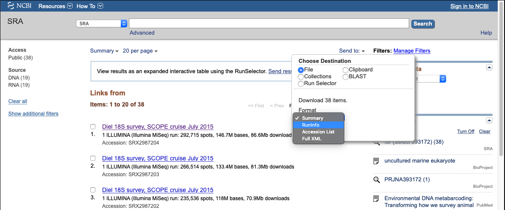

# tagseq-qiime2-snakemake
Pipeline to run qiime2 with snakemake


# Set up

* make working directory of raw_data (sra explorer tool), intro dataset as test
* Bioproject: PRJNA393172 - see screen shot, download run information.
* https://ewels.github.io/sra-explorer/
* Make sure database is set up  - link to other repo
* Generate manifest file


```
git clone https://github.com/shu251/tagseq-qiime2-snakemake.git
cd tagseq-qiime2-snakemake

# Create conda environment
conda env create -f /envs/snake-18S-env.yaml --name snake-18S 

# Enter environment
source activate snake-18S

# Check versions and correct environment set up
snakemake --version
qiime info
```

Download tag-sequencing data from SRA  

First search for sequences by BioProject. Example screenshot of how to download the ```SraRunInfo.csv``` table. Click _RunInfo_ from the **Send to:** drop down menu (highlight in blue below). This table is also included in this repo as an example. Use the R script to generate a bash script to download all the sequences.


```
cd tagseq-qiime2-snakemake/raw_data/
Rscript extract-sra.R
# R code will generate 2 bash scripts to download from SRA

# Download forward and reverse reads:
bash download_read1.sh
bash download_read2.sh
```


Create ```manifest.txt``` for input into qiime2

This code generates a manifest file based on all the fastq files downloaded into the raw_dir. It also parses sample names to generate the sample-id for the manifest list. The sample ID information is dependent on how the fastq files were downloaded, thus this code is specific to the 'extract-sra.R' and subsequent download process.

```
# Run R script
Rscript write-manifest.R
```
